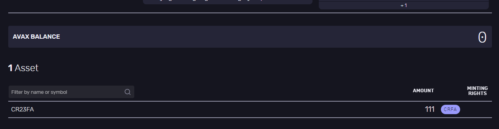

### Create a Fixed Cap Asset

### Install and run Avalanche node
#####  First Terminal
```bash
$ go get -v -d github.com/ava-labs/avalanchego/...
$ cd $GOPATH/src/github.com/ava-labs/avalanchego
$ ./scripts/build.sh
```

##### Second Terminal
> Check Bootstrapped Info
```bash
$ curl -X POST --data '{
    "jsonrpc":"2.0",
    "id"     :1,
    "method" :"info.isBootstrapped",
    "params": {
        "chain":"X"
    }
}' -H 'content-type:application/json;' 127.0.0.1:9650/ext/info
```


> Create Keystore 
```bash
$ curl -X POST --data '{
    "jsonrpc": "2.0",
    "id": 1,
    "method": "keystore.createUser",
    "params": {
        "username": "cr23",
        "password": "crypto23Pas_wd"
    }
}' -H 'content-type:application/json;' 127.0.0.1:9650/ext/keystore
```


> Create  Address
```bash
$ curl -X POST --data '{
    "jsonrpc":"2.0",
    "id"     :2,
    "method" :"avm.createAddress",
    "params" :{
        "username": "cr23",
        "password": "crypto23Pas_wd"
    }
}' -H 'content-type:application/json;' 127.0.0.1:9650/ext/bc/X
```


> Check the list of address
```bash
$ curl -X POST --data '{
    "jsonrpc": "2.0",
    "method": "avm.listAddresses",
    "params": {
        "username": "cr23",
        "password": "crypto23Pas_wd"
    },
    "id": 1
}'  -H 'content-type:application/json;' 127.0.0.1:9650/ext/bc/X
```
> Result
```bash
{"jsonrpc":"2.0","result":{"addresses":[
    "X-fuji1g26acm4xg7udg3tzt5na43ug24jh4nq63343sk",
    "X-fuji1mvrr4zrkxxe08g2323u53yrut9cvsfrc64hydj",
    "X-fuji13fhs4x24fylxcwr3v76lhc6fr50whmgvjwjqmu",
    "X-fuji125x728u6zgjyehttygj3sw0gl69tzuws8yu900",
    "X-fuji1rlvf550kcneaxlgs5nggnydzfqkjfm9um084y2",
    "X-fuji18jma8ppw3nhx5r4ap8clazz0dps7rv5u6wmu4t",
    "X-fuji13qpmw9sf4smp2fydd2468upjwlma4qujqw820p"]},"id":1}
```

>>> Send some funds from avalanche wallet to "From Address"

> Create Fixed Cap Asset
```bash
$ curl -X POST --data '{
    "jsonrpc":"2.0",
    "id"     : 1,
    "method" :"avm.createFixedCapAsset",
    "params" :{
        "name": "CR23FA",
        "symbol":"CRFA",
        "denomination": 0,
        "initialHolders": [
            {
                "address": "X-fuji1g26acm4xg7udg3tzt5na43ug24jh4nq63343sk",
                "amount": 10203040
            }
        ],
        "from":["X-fuji1mvrr4zrkxxe08g2323u53yrut9cvsfrc64hydj"],
        "changeAddr":"X-fuji13fhs4x24fylxcwr3v76lhc6fr50whmgvjwjqmu",
        "username": "cr23",
        "password": "crypto23Pas_wd"
    }
}' -H 'content-type:application/json;' 127.0.0.1:9650/ext/bc/X
```

> Result
```bash
{"jsonrpc":"2.0","result":{"assetID":"2NwoT4cWxQaPwkHxgcu12696erpgY8SyjLPxts78cJWJA9hGBv","changeAddr":"X-fuji13fhs4x24fylxcwr3v76lhc6fr50whmgvjwjqmu"},"id":1}
```

> Check Balance
```bash
$ curl -X POST --data '{
    "jsonrpc":"2.0",
    "id"     :1,
    "method" :"avm.getBalance",
    "params" :{
        "address":"X-fuji1g26acm4xg7udg3tzt5na43ug24jh4nq63343sk",
        "assetID":"2NwoT4cWxQaPwkHxgcu12696erpgY8SyjLPxts78cJWJA9hGBv"
    },
        "username": "cr23",
        "password": "crypto23Pas_wd"
}' -H 'content-type:application/json;' 127.0.0.1:9650/ext/bc/X
```
> Result
```bash
{"jsonrpc":"2.0","result":{"balance":"10203040","utxoIDs":[{"txID":"2NwoT4cWxQaPwkHxgcu12696erpgY8SyjLPxts78cJWJA9hGBv","outputIndex":1}]},"id":1}
```

> Send Asset
```bash
$  curl -X POST --data '{
    "jsonrpc":"2.0",
    "id"     :1,
    "method" :"avm.send",
    "params" :{
        "username": "cr23",
        "password": "crypto23Pas_wd",
        "assetID" :"2NwoT4cWxQaPwkHxgcu12696erpgY8SyjLPxts78cJWJA9hGBv",
        "amount"  : 111,
        "to"      :"X-fuji125x728u6zgjyehttygj3sw0gl69tzuws8yu900"
    }
}' -H 'content-type:application/json;' 127.0.0.1:9650/ext/bc/X   
```
> Result
```bash
{"jsonrpc":"2.0","result":{"txID":"55W4HGDNXpvbnW6CdZmJbXLgyPidXoPRmFYBVxv636phbjNER","changeAddr":"X-fuji1g26acm4xg7udg3tzt5na43ug24jh4nq63343sk"},"id":1}
```

> Check Transaction Status
```bash
$ curl -X POST --data '{
    "jsonrpc":"2.0",
    "id"     :1,
    "method" :"avm.getTxStatus",
    "params" :{
        "txID":"55W4HGDNXpvbnW6CdZmJbXLgyPidXoPRmFYBVxv636phbjNER",
        "username": "cr23",
        "password": "crypto23Pas_wd"
    }
}' -H 'content-type:application/json;' 127.0.0.1:9650/ext/bc/X
```
> Result
```bash
{"jsonrpc":"2.0","result":{"status":"Accepted"},"id":1}
```


> Check Balance of Address
```bash
$ curl -X POST --data '{
    "jsonrpc":"2.0",
    "id"     :1,
    "method" :"avm.getBalance",
    "params" :{
        "address":"X-fuji125x728u6zgjyehttygj3sw0gl69tzuws8yu900",
        "assetID":"2NwoT4cWxQaPwkHxgcu12696erpgY8SyjLPxts78cJWJA9hGBv"
    }
}' -H 'content-type:application/json;' 127.0.0.1:9650/ext/bc/X
```

> Result
```bash
{"jsonrpc":"2.0","result":{"balance":"111","utxoIDs":[{"txID":"ZhvizLrEAvvbdgA23u5v4xhb9kXQPjqjNU4xYjhCUoKazWizP","outputIndex":0}]},"id":1}
```
<p align="center">

</p>