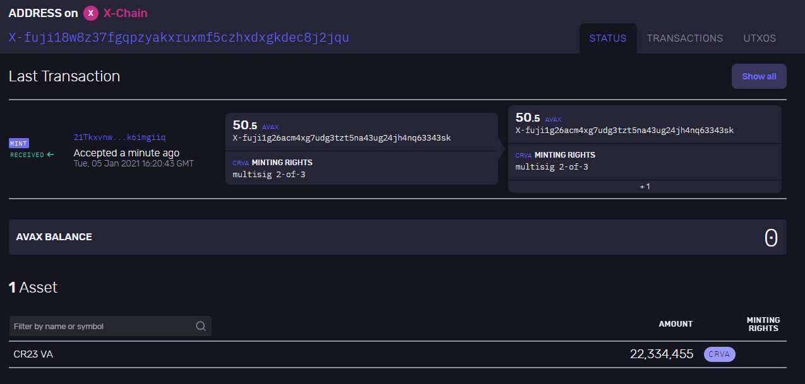
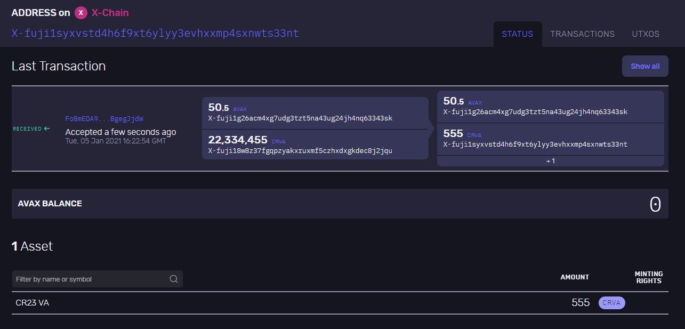

### Create a Variable Cap Asset

### Install and run Avalanche node
#####  First Terminal
```bash
$ go get -v -d github.com/ava-labs/avalanchego/...
$ cd $GOPATH/src/github.com/ava-labs/avalanchego
$ ./scripts/build.sh
```

##### Second Terminal
> Check Bootstrapped Info
```bash
$ curl -X POST --data '{
    "jsonrpc":"2.0",
    "id"     :1,
    "method" :"info.isBootstrapped",
    "params": {
        "chain":"X"
    }
}' -H 'content-type:application/json;' 127.0.0.1:9650/ext/info
```


> Create Keystore 
```bash
$ curl -X POST --data '{
    "jsonrpc": "2.0",
    "id": 1,
    "method": "keystore.createUser",
    "params": {
        "username": "cr23",
        "password": "crypto23Pas_wd"
    }
}' -H 'content-type:application/json;' 127.0.0.1:9650/ext/keystore
```


> Create  Address
```bash
$ curl -X POST --data '{
    "jsonrpc":"2.0",
    "id"     :2,
    "method" :"avm.createAddress",
    "params" :{
        "username": "cr23",
        "password": "crypto23Pas_wd"
    }
}' -H 'content-type:application/json;' 127.0.0.1:9650/ext/bc/X
```


> Check the list of address
```bash
$ curl -X POST --data '{
    "jsonrpc": "2.0",
    "method": "avm.listAddresses",
    "params": {
        "username": "cr23",
        "password": "crypto23Pas_wd"
    },
    "id": 1
}'  -H 'content-type:application/json;' 127.0.0.1:9650/ext/bc/X
```
> Result
```bash
{"jsonrpc":"2.0",
"result":{"addresses":[
    "X-fuji1g26acm4xg7udg3tzt5na43ug24jh4nq63343sk",
    "X-fuji1mvrr4zrkxxe08g2323u53yrut9cvsfrc64hydj",
    "X-fuji13fhs4x24fylxcwr3v76lhc6fr50whmgvjwjqmu",
    "X-fuji125x728u6zgjyehttygj3sw0gl69tzuws8yu900",
    "X-fuji1rlvf550kcneaxlgs5nggnydzfqkjfm9um084y2",
    "X-fuji18jma8ppw3nhx5r4ap8clazz0dps7rv5u6wmu4t",
    "X-fuji13qpmw9sf4smp2fydd2468upjwlma4qujqw820p",
    "X-fuji1yujhy27zh4h40cwnp6g3jcglr3xymkcfhad4lf",
    "X-fuji1z2luw0hd70rcyh7n59lv03806f03v9t46avy6h",
    "X-fuji10nkyscw60t7avmjzjk5zdmlrhnpz9gkj8fjug3",
    "X-fuji18w8z37fgqpzyakxruxmf5czhxdxgkdec8j2jqu",
    "X-fuji1syxvstd4h6f9xt6ylyy3evhxxmp4sxnwts33nt",
    "X-fuji1yhxldr0ltcr32j8p7va3ey3j6559ulgfhfgh20"]},"id":1}
```


> Send Asset
```bash
$  curl -X POST --data '{
    "jsonrpc":"2.0",
    "id"     :1,
    "method" :"avm.send",
    "params" :{
        "username": "cr23",
        "password": "crypto23Pas_wd",
        "assetID" : "AVAX",
        "amount"  : 12345,
        "to"      :"X-local17l5qask7mssefpun3s2eyqxn20lptfw9jqheea"
    }
}' -H 'content-type:application/json;' 127.0.0.1:9650/ext/bc/X   
```
> Result
```bash
{"jsonrpc":"2.0","result":{"txID":"WqCyiQQekDVJa3E8vrGyMVwx5pgwh72XY2oiM7K4v4NLV8gh","changeAddr":"X-local1vtwum8envtu5lhf7sgxl54mvzvg8agtverec2y"},"id":1}
```

> Create Variable Cap Asset
```bash
$ curl -X POST --data '{
    "jsonrpc":"2.0",
    "id"     : 1,
    "method" :"avm.createVariableCapAsset",
    "params" :{
        "name":"CR23 VA",
        "symbol":"CRVA",
        "minterSets":[
            {
                "minters": [
                    "X-fuji13qpmw9sf4smp2fydd2468upjwlma4qujqw820p"
                ],
                "threshold": 1
            },
            {
                "minters": [
    "X-fuji1yujhy27zh4h40cwnp6g3jcglr3xymkcfhad4lf",
    "X-fuji1z2luw0hd70rcyh7n59lv03806f03v9t46avy6h",
    "X-fuji10nkyscw60t7avmjzjk5zdmlrhnpz9gkj8fjug3"
                ],
                "threshold": 2
            }
        ],
        "from":["X-fuji1mvrr4zrkxxe08g2323u53yrut9cvsfrc64hydj"],
        "changeAddr":"X-fuji13fhs4x24fylxcwr3v76lhc6fr50whmgvjwjqmu",
        "username": "cr23",
        "password": "crypto23Pas_wd"
    }
}' -H 'content-type:application/json;' 127.0.0.1:9650/ext/bc/X
```

> Result
```bash
{"jsonrpc":"2.0","result":{"assetID":"dgy2ATJAwZnt72sk7fCkb7XLhG55W8t7wQ45KB5rbVbpCidf3","changeAddr":"X-fuji13fhs4x24fylxcwr3v76lhc6fr50whmgvjwjqmu"},"id":1}
```
> Send Asset
```bash
$ curl -X POST --data '{
    "jsonrpc":"2.0",
    "id"     : 1,
    "method" :"avm.mint",
    "params" :{
        "amount":22334455,
        "assetID":"dgy2ATJAwZnt72sk7fCkb7XLhG55W8t7wQ45KB5rbVbpCidf3",
        "to":"X-fuji18w8z37fgqpzyakxruxmf5czhxdxgkdec8j2jqu",
        "username": "cr23",
        "password": "crypto23Pas_wd"
    }
}' -H 'content-type:application/json;' 127.0.0.1:9650/ext/bc/X
```
> Result
```bash
{"jsonrpc":"2.0","result":{"txID":"21TkxvnwGLbTNvNeDG8qJxXQYJAKiQpc9z6krHxCWbk6imgiiq","changeAddr":"X-fuji1g26acm4xg7udg3tzt5na43ug24jh4nq63343sk"},"id":1}
```
> Check Balance
```bash
$ curl -X POST --data '{
    "jsonrpc":"2.0",
    "id"     :1,
    "method" :"avm.getBalance",
    "params" :{
        "address":"X-fuji18w8z37fgqpzyakxruxmf5czhxdxgkdec8j2jqu",
        "assetID":"dgy2ATJAwZnt72sk7fCkb7XLhG55W8t7wQ45KB5rbVbpCidf3"
    },
    "username": "cr23",
    "password": "crypto23Pas_wd"
}' -H 'content-type:application/json;' 127.0.0.1:9650/ext/bc/X
```
> Result
```bash
{"jsonrpc":"2.0","result":{"balance":"22334455","utxoIDs":[{"txID":"21TkxvnwGLbTNvNeDG8qJxXQYJAKiQpc9z6krHxCWbk6imgiiq","outputIndex":2}]},"id":1}
```

> Send Assets
```bash
$ curl -X POST --data '{
    "jsonrpc":"2.0",
    "id"     :1,
    "method" :"avm.send",
    "params" :{
        "username": "cr23",
        "password": "crypto23Pas_wd",
        "assetID" :"dgy2ATJAwZnt72sk7fCkb7XLhG55W8t7wQ45KB5rbVbpCidf3",
        "amount"  : 555,
        "to"      :"X-fuji1syxvstd4h6f9xt6ylyy3evhxxmp4sxnwts33nt"
    }
}' -H 'content-type:application/json;' 127.0.0.1:9650/ext/bc/X
```
```bash
> Result 
{"jsonrpc":"2.0","result":{"txID":"Fo8mEDA9zafDTCKhk591HFnodp35inWwV5vtiu7tCBgegJjdW","changeAddr":"X-fuji1g26acm4xg7udg3tzt5na43ug24jh4nq63343sk"},"id":1}
```

> Check Balance of the Asset
```bash
$ curl -X POST --data '{
    "jsonrpc":"2.0",
    "id"     :1,
    "method" :"avm.getBalance",
    "params" :{
        "address":"X-fuji1syxvstd4h6f9xt6ylyy3evhxxmp4sxnwts33nt",
        "assetID":"dgy2ATJAwZnt72sk7fCkb7XLhG55W8t7wQ45KB5rbVbpCidf3",
        "username": "cr23",
        "password": "crypto23Pas_wd"
    }
}' -H 'content-type:application/json;' 127.0.0.1:9650/ext/bc/X
```


> Result
```bash
{"jsonrpc":"2.0","result":{"balance":"555","utxoIDs":[{"txID":"Fo8mEDA9zafDTCKhk591HFnodp35inWwV5vtiu7tCBgegJjdW","outputIndex":1}]},"id":1}
```
<p align="center">


</p>