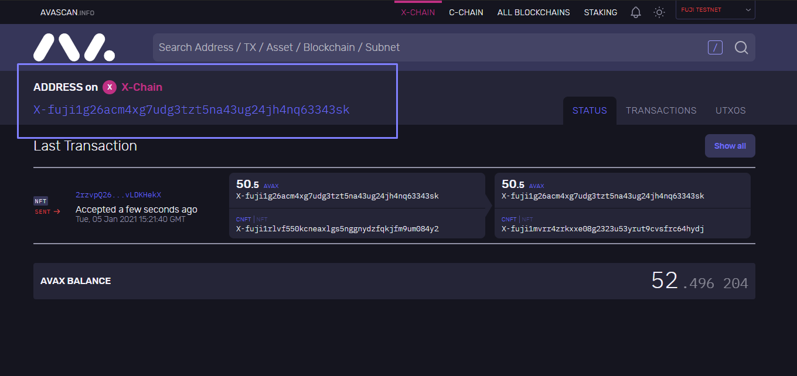

### Create NFT 

####  NFT (Using Fuji Network)
##### First Terminal

```bash
$ cd $GOPATH/src/github.com/ava-labs/avalanchego
$ ./build/avalanchego --network-id=fuji
```
##### Second Terminal
> Check Bootstrapped Info
```bash
$ curl -X POST --data '{
    "jsonrpc":"2.0",
    "id"     :1,
    "method" :"info.isBootstrapped",
    "params": {
        "chain":"X"
    }
}' -H 'content-type:application/json;' 127.0.0.1:9650/ext/info
```
> Create Keystore 
```bash
$ curl -X POST --data '{
    "jsonrpc": "2.0",
    "id": 1,
    "method": "keystore.createUser",
    "params": {
        "username": "cr23",
        "password": "crypto23Pas_wd"
    }
}' -H 'content-type:application/json;' 127.0.0.1:9650/ext/keystore
```
> Create  Address | (X-Chain)
```bash
$ curl -X POST --data '{
    "jsonrpc":"2.0",
    "id"     :2,
    "method" :"avm.createAddress",
    "params" :{
        "username": "cr23",
        "password": "crypto23Pas_wd"
    }
}' -H 'content-type:application/json;' 127.0.0.1:9650/ext/bc/X
```
> Result
```bash
{"jsonrpc":"2.0","result":{"address":"X-fuji1rlvf550kcneaxlgs5nggnydzfqkjfm9um084y2"},"id":2}
```

> Import private key
```bash
$ curl --location --request POST 'localhost:9650/ext/X' \
--header 'Content-Type: application/json' \
--data-raw '{
    "jsonrpc": "2.0",
    "method": "avm.importKey",
    "params":{
        "username": "cr23",
        "password": "crypto23Pas_wd",
          "privateKey":"PrivateKey-ewoqjP7PxY4yr3iLTpLisriqt94hdyDFNgchSxGGztUrTXtNN"
    },
    "id": 1
}'
```
> Result
```bash
{"jsonrpc":"2.0","result":{"address":"X-fuji18jma8ppw3nhx5r4ap8clazz0dps7rv5u6wmu4t"},"id":1}
```

> Create NFT Asset
```bash
$ curl -X POST --data '{
    "jsonrpc":"2.0",
    "id"     :1,
    "method" :"avm.createNFTAsset",
    "params" :{
        "name":"CR23NFT",
        "symbol":"CNFT",
        "minterSets":[
            {
                "minters": [
                    "X-fuji18jma8ppw3nhx5r4ap8clazz0dps7rv5u6wmu4t"
                ],
                "threshold": 1
            }
        ],
        "username": "cr23",
        "password": "crypto23Pas_wd"
    }
}' -H 'content-type:application/json;' 127.0.0.1:9650/ext/bc/X
```
> Result
```bash
{"jsonrpc":"2.0","result":{"assetID":"2GPUsjDQH8EVGtugypnP8Ui7dgXfM674ML2mytEweHEyzDPJDf","changeAddr":"X-fuji1g26acm4xg7udg3tzt5na43ug24jh4nq63343sk"},"id":1}
```

> Get UTXOs for NFT
```bash
$ curl -X POST --data '{
    "jsonrpc":"2.0",
    "id"     : 1,
    "method" :"avm.getUTXOs",
    "params" :{
        "addresses":["X-fuji1g26acm4xg7udg3tzt5na43ug24jh4nq63343sk"]
    },
        "username": "cr23",
        "password": "crypto23Pas_wd"
}' -H 'content-type:application/json;' 127.0.0.1:9650/ext/bc/X
```

> Result
```bash
{"jsonrpc":"2.0","result":{"numFetched":"3","utxos":["11Q6eBt7xr4kA9sPKJ4m51QUQgkQn7HJz2j9SXzGTRafxfn7xkUyP7iJs8t3dv3kQVGFR2xy1Y9LL3NbZQDCrzpi3hUCAaA5ETkfc6zFL55RBwZ1gdKWe1juXGguCKs8TjiTUgVDWN9QZhVsZX6utc4ZMVxP3YosHzC1bX","11UPS1bT5pvoPANGtWj8vRj9jP9sgbwAiLBSjAHX2seHoqKRsvDSrjS7bs145C9CbuRxyeUC2Q5eySmaGj9W2N8CAAUbMC17DXdMg4F6B5AfmSTkxpVRdQBUABUDDUJKUcCTTJQJ6JQA9DtVoQDEEY3bgeTXKFFDVSRAdP","118qLpurU245yZrkbydUAU2xBKgwKDTK19pta8XXZGh4XQtbGGzo1BKRomk1QrMYhEvRhkHhLPLuv4Qc62SLPQHawqcoupE6JwZc3CirdGdK8pmRCBMQR11eP2YuAx2a6XVsJyVc6U4iiVP3W52QfbXfQ4APBgWBcNxdP9"],"endIndex":{"address":"X-fuji1g26acm4xg7udg3tzt5na43ug24jh4nq63343sk","utxo":"2SSiiewDh2YuxtB7tUs7Q3f328r6LGBW6vfqDwL89EqHGzezHW"},"encoding":"cb58"},"id":1}
```
> Mint the Asset
```bash
$ curl -X POST --data '{
    "jsonrpc":"2.0",
    "id"     : 1,
    "method" :"avm.mintNFT",
    "params" :{
        "assetID":"2GPUsjDQH8EVGtugypnP8Ui7dgXfM674ML2mytEweHEyzDPJDf",
        "payload":"2EWh72jYQvEJF9NLk",
        "to":"X-fuji1rlvf550kcneaxlgs5nggnydzfqkjfm9um084y2",
        "username": "cr23",
        "password": "crypto23Pas_wd"
    }
}' -H 'content-type:application/json;' 127.0.0.1:9650/ext/bc/X
```
> Result
```bash
{"jsonrpc":"2.0","result":{"txID":"2TjeyMFBMayTN8AdNYVoczBNXESRLyVn5sB9Ma3Cutd7K5KFj9","changeAddr":"X-fuji1g26acm4xg7udg3tzt5na43ug24jh4nq63343sk"},"id":1}
```
> Get UTXOs for NFT Mint
```bash
$ curl -X POST --data '{
    "jsonrpc":"2.0",
    "id"     : 1,
    "method" :"avm.getUTXOs",
    "params" :{
        "addresses":["X-fuji1rlvf550kcneaxlgs5nggnydzfqkjfm9um084y2"]
    },
        "username": "cr23",
        "password": "crypto23Pas_wd"
}' -H 'content-type:application/json;' 127.0.0.1:9650/ext/bc/X
```
> Result
```bash
{"jsonrpc":"2.0","result":{"numFetched":"1","utxos":["11LgwRLvq5Nibb772FvzUEvvLkM7D453wDdygsweKx8xGLQgQ2KV3b3Uer2VxEDbmveMo96aYvsKecWvHi9ucbxQ2m2AY8SN5vejXS31xTLYqEqekDmrhfCHyop3Rj86oQ5kZ6C5ULjvhSefhW8z7D9GnNRE2mAg6KWw1itW6yV1AJuvq"],"endIndex":{"address":"X-fuji1rlvf550kcneaxlgs5nggnydzfqkjfm9um084y2","utxo":"2ET4qib2dLFugShuF743KVzrmcQKXyunGKt8Zwbzda2h5T6nBW"},"encoding":"cb58"},"id":1}
```
> Send NFT
```bash
$ curl -X POST --data '{
    "jsonrpc":"2.0",
    "id"     :1,
    "method" :"avm.sendNFT",
    "params" :{
        "assetID" :"2GPUsjDQH8EVGtugypnP8Ui7dgXfM674ML2mytEweHEyzDPJDf",
        "to"      :"X-fuji1mvrr4zrkxxe08g2323u53yrut9cvsfrc64hydj",
        "groupID" : 0,
        "username": "cr23",
        "password": "crypto23Pas_wd"
    }

}' -H 'content-type:application/json;' 127.0.0.1:9650/ext/bc/X
```
> Result
```bash
{"jsonrpc":"2.0","result":{"txID":"2rzvpQ26R7DayqJfHdJZAGAYoxALr4pvT64MYeHAxUvLDKHekX","changeAddr":"X-fuji1g26acm4xg7udg3tzt5na43ug24jh4nq63343sk"},"id":1}
```
> ADDRESS RESULT ( X-fuji1rlvf550kcneaxlgs5nggnydzfqkjfm9um084y2 )
<p align="center">

</p>
