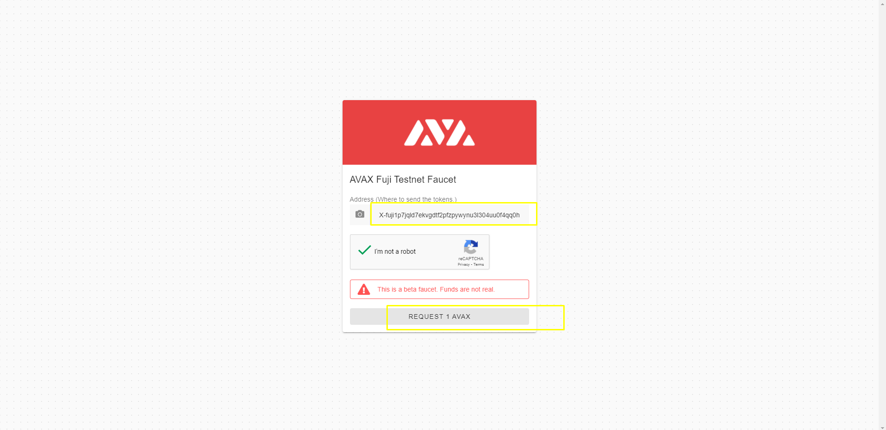
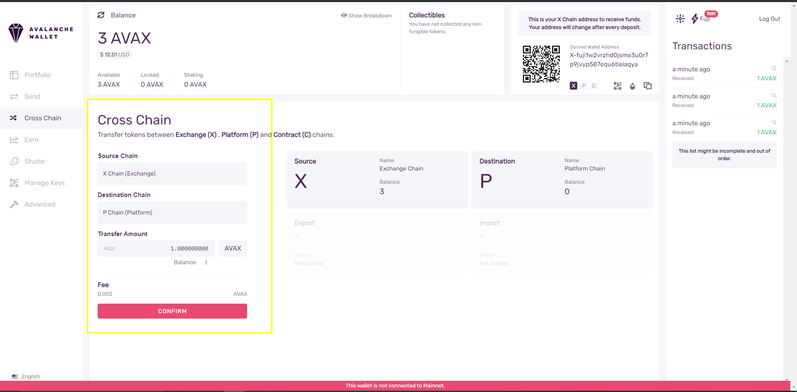
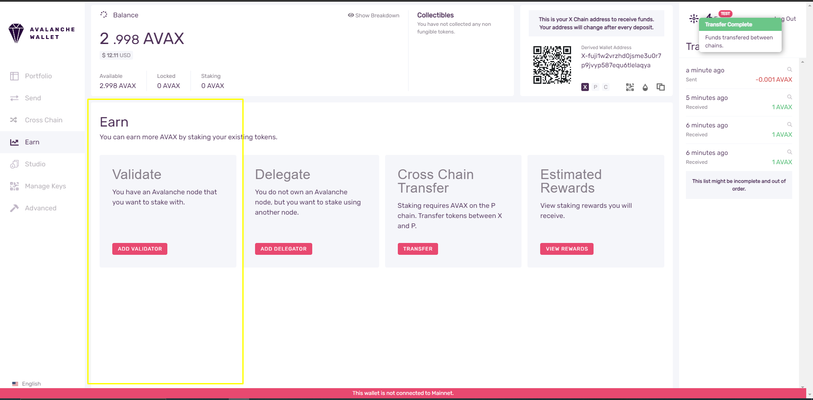
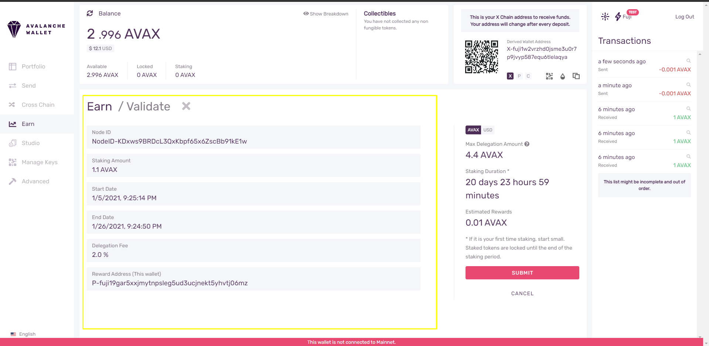
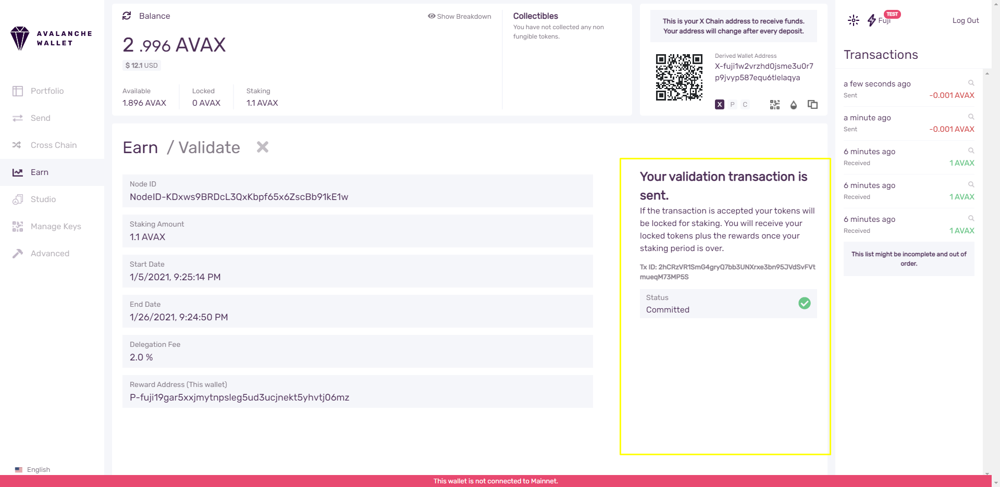

### Create a New Blockchain

>> Add a Validator

>> Adding Validator with API Call

>> Create Genesis

>> Create New Blockchain


### Install and run Avash node
> First Terminal

```bash
$ cd $GOPATH/src/github.com/ava-labs/avash
$ ./avash
$ runscript scripts/five_node_staking.lua

```
> Second Terminal
> 
>> And Check The Bootstrapped Info
```bash
$ curl -X POST --data '{
    "jsonrpc":"2.0",
    "id"     :1,
    "method" :"info.isBootstrapped",
    "params": {
        "chain":"X"
    }
}' -H 'content-type:application/json;' 127.0.0.1:9650/ext/info
```


> Create Keystore 
```bash
$ curl -X POST --data '{
    "jsonrpc": "2.0",
    "id": 1,
    "method": "keystore.createUser",
    "params": {
        "username": "cr23",
        "password": "crypto23Pas_wd"
    }
}' -H 'content-type:application/json;' 127.0.0.1:9650/ext/keystore
```


> Create  Address | platform
```bash
$ curl -X POST --data '{
    "jsonrpc": "2.0",
    "method": "platform.createAddress",
    "params": {
        "username": "cr23",
        "password": "crypto23Pas_wd"
    },
    "id": 1
}' -H 'content-type:application/json;' 127.0.0.1:9650/ext/P
```
> Result
```bash
{"jsonrpc":"2.0","result":{"address":"P-fuji19ktkejmfrjyqxyufrqxvlafxgvrpxsxu0mc89w"},"id":1}
```

> List Address
```bash
$ curl -X POST --data '{
    "jsonrpc": "2.0",
    "method": "platform.listAddresses",
    "params": {
        "username": "cr23",
        "password": "crypto23Pas_wd"
    },
    "id": 1
}'  -H 'content-type:application/json;' 127.0.0.1:9650/ext/bc/P
```
> Result
```bash
{
    "jsonrpc":"2.0",
    "result":{
        "addresses":[
            "P-local1lpytuv3fd64qtdrht0mvrpavgre5qrp282a2hr",
            "P-local1m47695aywj2eerm8ykk9fc39q797lx0hqf306y",
            "P-local1a0k6xjl3e00nc2ff2kxgggukxq476mwhyatypg",
            "P-local1l5unlws3cac4d3pslr2hpezjjf8r890j9fvner",
            "P-local1rwdwuc3mngpaqculdz58xtadhpx8ugj305gp6m",
            "P-local1yqcjp8csexh58sg5llm85apg0l02vmppge8fgd",
            "P-local1j866p8a56q6egclx425sa34macad7e2jcp5c8z",
            "P-local18jma8ppw3nhx5r4ap8clazz0dps7rv5u00z96u",
            "P-local1y70fgnljmjp8pcvaejl23gl9a6w9a9cflfu5vz",
            "P-local1xsqynzq6pfqm6594fz6649qc2umn7cgvzjwh78",
            "P-local1l58cdlqzk6q0eaf4eyadfe77cezf7qcgeka6q7"]},"id":1
}
```
> Import private key
```bash
$ curl --location --request POST 'localhost:9650/ext/P' \
--header 'Content-Type: application/json' \
--data-raw '{
    "jsonrpc": "2.0",
    "method": "platform.importKey",
    "params":{
        "username": "cr23",
        "password": "crypto23Pas_wd",
          "privateKey":"PrivateKey-ewoqjP7PxY4yr3iLTpLisriqt94hdyDFNgchSxGGztUrTXtNN"
    },
    "id": 1
}'
```
> Result
```bash
{"jsonrpc":"2.0","result":{"address":"P-fuji18jma8ppw3nhx5r4ap8clazz0dps7rv5u6wmu4t"},"id":1}
```


> Get Node ID
```bash
$ curl -X POST --data '{
    "jsonrpc":"2.0",
    "id"     :1,
    "method" :"info.getNodeID"
}' -H 'content-type:application/json;' 127.0.0.1:9650/ext/info
```
> Result
```bash
{"jsonrpc":"2.0","result":{"nodeID":"NodeID-KDxws9BRDcL3QxKbpf65x6ZscBb91kE1w"},"id":1}
```

> Add Validator
>> Adding Validator with API Call
```bash
$ curl -X POST --data '{
    "jsonrpc": "2.0",
    "method": "platform.addValidator",
    "params": {
        "nodeID":"NodeID-KDxws9BRDcL3QxKbpf65x6ZscBb91kE1w",
        "startTime":'$(date --date="10 minutes" +%s)',
        "endTime":'$(date --date="30 days" +%s)',
        "stakeAmount":2000000000000,
        "rewardAddress":"P-local1lpytuv3fd64qtdrht0mvrpavgre5qrp282a2hr",
        "changeAddr": "P-local1m47695aywj2eerm8ykk9fc39q797lx0hqf306y",
        "delegationFeeRate":10,
        "username": "cr23",
        "password": "crypto23Pas_wd"
    },
    "id": 1
}' -H 'content-type:application/json;' 127.0.0.1:9650/ext/P
```
> Result
```bash
{"jsonrpc":"2.0","result":{"txID":"cQfeLMjqVMxA6kTSQkPLmrYhxTY4i5MKE34DDJz1b3Fg72ikn","changeAddr":"P-local1m47695aywj2eerm8ykk9fc39q797lx0hqf306y"},"id":1}
```

> Check Status
```bash
$ curl -X POST --data '{
    "jsonrpc": "2.0",
    "method": "platform.getTxStatus",
    "params": {
        "txID":"cQfeLMjqVMxA6kTSQkPLmrYhxTY4i5MKE34DDJz1b3Fg72ikn",
        "username": "cr23",
        "password": "crypto23Pas_wd"
    },
    "id": 1
}' -H 'content-type:application/json;' 127.0.0.1:9650/ext/P
```

> Result
```bash
{"jsonrpc":"2.0","result":"Committed","id":1}
```


>> Add vAlidator with Avalanche Wallet

```bash
$ curl -X POST --data '{
    "jsonrpc": "2.0",
    "method": "platform.addValidator",
    "params": {
        "nodeID":"NodeID-KDxws9BRDcL3QxKbpf65x6ZscBb91kE1w",
        "startTime":'$(date --date="10 minutes" +%s)',
        "endTime":'$(date --date="30 days" +%s)',
        "stakeAmount":2000000000000,
        "rewardAddress":"P-local1lpytuv3fd64qtdrht0mvrpavgre5qrp282a2hr",
        "changeAddr": "P-local1m47695aywj2eerm8ykk9fc39q797lx0hqf306y",
        "delegationFeeRate":10,
        "username": "cr23",
        "password": "crypto23Pas_wd"
    },
    "id": 1
}' -H 'content-type:application/json;' 127.0.0.1:9650/ext/P
```
> Result
```bash
{"jsonrpc":"2.0","result":{"txID":"cQfeLMjqVMxA6kTSQkPLmrYhxTY4i5MKE34DDJz1b3Fg72ikn","changeAddr":"P-local1m47695aywj2eerm8ykk9fc39q797lx0hqf306y"},"id":1}
```

> Check Status
```bash
$ curl -X POST --data '{
    "jsonrpc": "2.0",
    "method": "platform.getTxStatus",
    "params": {
        "txID":"cQfeLMjqVMxA6kTSQkPLmrYhxTY4i5MKE34DDJz1b3Fg72ikn",
        "username": "cr23",
        "password": "crypto23Pas_wd"
    },
    "id": 1
}' -H 'content-type:application/json;' 127.0.0.1:9650/ext/P
```

> Result
```bash
{"jsonrpc":"2.0","result":"Committed","id":1}
```
>>> Open the wallet
>>>>> Use faucet to get some funds nd 
>>>>> go to the Earn tab, Cross Chain Transfer (transfer between X > C > P chain) then Choose Add Validator

<p align="center">





</p>


> Create the Genesis Data

>> Create Another address
```bash
$ curl -X POST --data '{
    "jsonrpc": "2.0",
    "method": "platform.createAddress",
    "params": {
        "username": "cr23",
        "password": "crypto23Pas_wd"
    },
    "id": 1
}' -H 'content-type:application/json;' 127.0.0.1:9650/ext/P
```

> List Address
```bash
$ curl -X POST --data '{
    "jsonrpc": "2.0",
    "method": "platform.listAddresses",
    "params": {
        "username": "cr23",
        "password": "crypto23Pas_wd"
    },
    "id": 1
}'  -H 'content-type:application/json;' 127.0.0.1:9650/ext/bc/P
```
> Result
```bash
{
    "jsonrpc":"2.0",
    "result":{
        "addresses":[
            "P-local1lpytuv3fd64qtdrht0mvrpavgre5qrp282a2hr",
            "P-local1m47695aywj2eerm8ykk9fc39q797lx0hqf306y",
            "P-local1a0k6xjl3e00nc2ff2kxgggukxq476mwhyatypg",
            "P-local1l5unlws3cac4d3pslr2hpezjjf8r890j9fvner",
            "P-local1rwdwuc3mngpaqculdz58xtadhpx8ugj305gp6m",
            "P-local1yqcjp8csexh58sg5llm85apg0l02vmppge8fgd",
            "P-local1j866p8a56q6egclx425sa34macad7e2jcp5c8z",
            "P-local18jma8ppw3nhx5r4ap8clazz0dps7rv5u00z96u",
            "P-local1y70fgnljmjp8pcvaejl23gl9a6w9a9cflfu5vz",
            "P-local1xsqynzq6pfqm6594fz6649qc2umn7cgvzjwh78",
            "P-local1l58cdlqzk6q0eaf4eyadfe77cezf7qcgeka6q7",
            "P-local14dq8z22f8zpzk9vvhs74mhrraaletwn4qf050r",
            "P-local1z3tg4zgjamnt6rag3367ws46ys4c457eqe32x0",
            "P-local1q5vqecsac99xj29aq6xad3hppmfnz56fsp9snu"]},
            "id":1
}
```
>> Build Genesis | avm.buildGenesis
```bash
$ curl -X POST --data '{
    "jsonrpc": "2.0",
    "id"     : 1,
    "method" : "avm.buildGenesis",
    "params" : {
        "genesisData": {
            "asset1": {
                "name": "crypto23",
                "symbol":"CR23",
                "initialState": {
                    "fixedCap" : [
                        {
                            "amount":100000,
                            "address": "local1lpytuv3fd64qtdrht0mvrpavgre5qrp282a2hr"
                        },
                        {
                            "amount":100000,
                            "address": "local1m47695aywj2eerm8ykk9fc39q797lx0hqf306y"
                        },
                        {
                            "amount":50000,
                            "address": "local1a0k6xjl3e00nc2ff2kxgggukxq476mwhyatypg"
                        },
                        {
                            "amount":50000,
                            "address": "local1l5unlws3cac4d3pslr2hpezjjf8r890j9fvner"
                        }
                    ]
                }
            },
            "asset2": {
                "name": "crypto23va",
                "symbol":"CVCA",
                "initialState": {
                    "variableCap" : [
                        {
                            "minters": [
                                "local1rwdwuc3mngpaqculdz58xtadhpx8ugj305gp6m",
                                "local1yqcjp8csexh58sg5llm85apg0l02vmppge8fgd"
                            ],
                            "threshold":1
                        },
                        {
                            "minters": [
                                "local1j866p8a56q6egclx425sa34macad7e2jcp5c8z",
                                "local18jma8ppw3nhx5r4ap8clazz0dps7rv5u00z96u",
                                "local1y70fgnljmjp8pcvaejl23gl9a6w9a9cflfu5vz"
                            ],
                            "threshold":2
                        }
                    ]
                }
            }
        }
    }
}' -H 'content-type:application/json;' 127.0.0.1:9650/ext/vm/avm
```

> Result
```bash
{"jsonrpc":"2.0","result":{"bytes":"11111jntSCtDEDUVUd1E2u7JPwpcig4Md92P8eh7GZd9CHrj2GU56iVvTLNeiGRJz7SjnwAe7faM3bS5tUiAiAbnFFZWTDu1Hbj7w2peUw9jhD9H1UJhZMDvrQYwpf4W8UazuGmGfPrdHyYLm9RRLMRTsTtrToUh4AbJMD71DhiSFPx2VsG6GYnypGgKhmyL9zZ8YfgnPtpibs5pHomyk1aBSWHwWUsvw2yuRiKdPBhCcUDGVxJFgDNA4HyrkEsSUrxPE4CnJtu2cuTcmS24ZTxyUsy7Zcf7BbEPfv65EF1Ed1CLGqSZyVpsgLGiBUuahJ1iZbbrHBtQZ8X5yyNobKfJcnSfPMyt9rxvoEr66evzLQMgcXMobjwMnha9JEgCtrDirn5pktMV356mhuYAPX1gsN7KjsTipds33zTNb86LScUiAdWJb8MgtSn7sHboSJRxLVvu88FKx3VJaqmD1s5VjEG6QGEscaorcewHR1xGu9Crnv7WmxhKMngz4wHSNMe2SQv7hms4jXQh1GWHKwNFAY7ywAkzBT2a2DnXWAxD3LMEwMBNwPwY4dPmbiAL8V2ZDb2tExb82fJVqsWMr8zS8yUyA4kPDkpBq3fBeVnhej1KzbcVp8C8VxzTMukSERa3BuHoK2vch2vKuNvxz75vXzxBiLA9LorXLgea8z2223df2ipxBvTn7b1","encoding":"cb58"},"id":1}
```
> Create the Blockchain
```bash
$ curl -X POST --data '{
    "jsonrpc": "2.0",
    "method": "platform.createBlockchain",
    "params" : {
        "subnetID": "2VN61C7KmqjFJrQ4tT8XQgkwnzFDLJ3hLaxSBitCoXykfLxTYA",
        "vmID":"avm",
        "name":"My new AVM",
        "genesisData": "11111jntSCtDEDUVUd1E2u7JPwpcig4Md92P8eh7GZd9CHrj2GU56iVvTLNeiGRJz7SjnwAe7faM3bS5tUiAiAbnFFZWTDu1Hbj7w2peUw9jhD9H1UJhZMDvrQYwpf4W8UazuGmGfPrdHyYLm9RRLMRTsTtrToUh4AbJMD71DhiSFPx2VsG6GYnypGgKhmyL9zZ8YfgnPtpibs5pHomyk1aBSWHwWUsvw2yuRiKdPBhCcUDGVxJFgDNA4HyrkEsSUrxPE4CnJtu2cuTcmS24ZTxyUsy7Zcf7BbEPfv65EF1Ed1CLGqSZyVpsgLGiBUuahJ1iZbbrHBtQZ8X5yyNobKfJcnSfPMyt9rxvoEr66evzLQMgcXMobjwMnha9JEgCtrDirn5pktMV356mhuYAPX1gsN7KjsTipds33zTNb86LScUiAdWJb8MgtSn7sHboSJRxLVvu88FKx3VJaqmD1s5VjEG6QGEscaorcewHR1xGu9Crnv7WmxhKMngz4wHSNMe2SQv7hms4jXQh1GWHKwNFAY7ywAkzBT2a2DnXWAxD3LMEwMBNwPwY4dPmbiAL8V2ZDb2tExb82fJVqsWMr8zS8yUyA4kPDkpBq3fBeVnhej1KzbcVp8C8VxzTMukSERa3BuHoK2vch2vKuNvxz75vXzxBiLA9LorXLgea8z2223df2ipxBvTn7b1",
        "username": "cr23",
        "password": "crypto23Pas_wd"
    },
    "id": 1
}' -H 'content-type:application/json;' 127.0.0.1:9650/ext/P
```
> Result
```bash
{"jsonrpc":"2.0","result":{"txID":"AicjGZxZHujhYetiPQ4fsZQUeDbUjVF9ZPnbmiKNJtHHTmnwF","changeAddr":"P-local1lpytuv3fd64qtdrht0mvrpavgre5qrp282a2hr"},"id":1}
```
> Verify Success
```bash
$ curl -X POST --data '{
    "jsonrpc":"2.0",
    "id"     :1,
    "method" :"platform.getBlockchains",
    "params" :{}
}' -H 'content-type:application/json;' 127.0.0.1:9650/ext/P
```

> Result
```bash
{"jsonrpc":"2.0","result":{"blockchains":[{"id":"2eNy1mUFdmaxXNj1eQHUe7Np4gju9sJsEtWQ4MX3ToiNKuADed","name":"X-Chain","subnetID":"11111111111111111111111111111111LpoYY","vmID":"jvYyfQTxGMJLuGWa55kdP2p2zSUYsQ5Raupu4TW34ZAUBAbtq"},{"id":"26sSDdFXoKeShAqVfvugUiUQKhMZtHYDLeBqmBfNfcdjziTrZA","name":"C-Chain","subnetID":"11111111111111111111111111111111LpoYY","vmID":"mgj786NP7uDwBCcq6YwThhaN8FLyybkCa4zBWTQbNgmK6k9A6"},{"id":"AicjGZxZHujhYetiPQ4fsZQUeDbUjVF9ZPnbmiKNJtHHTmnwF","name":"My new AVM","subnetID":"2VN61C7KmqjFJrQ4tT8XQgkwnzFDLJ3hLaxSBitCoXykfLxTYA","vmID":"jvYyfQTxGMJLuGWa55kdP2p2zSUYsQ5Raupu4TW34ZAUBAbtq"}]},"id":1}
```
