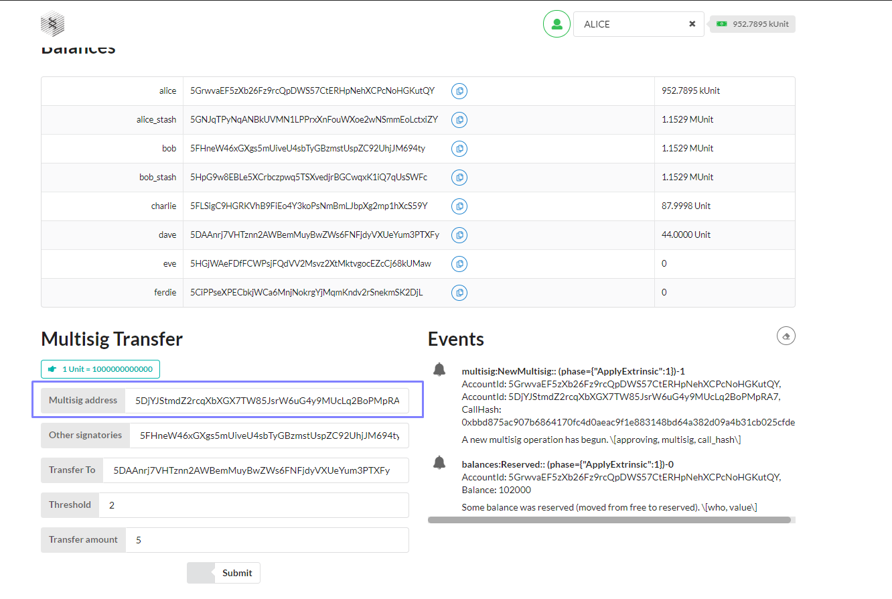

> [SUbstrate Node Template](https://github.com/crypto23-team/EnHc/tree/main/POLKADOT-ONBOARD/5%20Frame%20Multisig/nodetemplate)

> [SUbstrate Front End Template](https://github.com/crypto23-team/EnHc/tree/main/POLKADOT-ONBOARD/5%20Frame%20Multisig/frontend)

> [Polka Js Script](https://github.com/crypto23-team/EnHc/tree/main/POLKADOT-ONBOARD/5%20Frame%20Multisig/script)

    Script Js

  
  > Frontend

  > Polkajs

